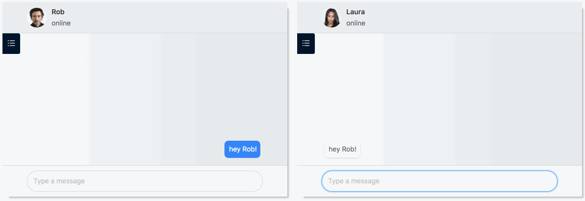

# Messenger
test
[](https://circleci.com/gh/gztomas/messenger)

This is a POC for simple messenger font-end app.



It uses React, Redux, Next.JS and Ant Design.

Circle CI does the CD to Github Pages. Check it out! https://gztomas.github.io/messenger

For demo purposes, you will see a split screen app.
You can check how it would look for a real use case at https://gztomas.github.io/messenger/standalone

## Install

You will need Yarn. If you are using macOS and have home-brew installed, then you can get it by doing

```sh
brew install yarn
```

Otherwise, please follow yarn team [instructions](https://yarnpkg.com/lang/en/docs/install)

Clone the repo and install the app dependencies with

```sh
git clone git@github.com:gztomas/messenger.git
cd messenger
yarn
```

You can then start the server locally with the following command

```sh
yarn build
yarn start
```

Then just open your browser at http://localhost:3000

## Development

A webpack-based dev environment which supports hot module replacement can be started with

```sh
yarn dev
```

### Tests

Tests are missing for the most cases, but you can check the [contact info component](https://github.com/gztomas/messenger/tree/master/src/components/contact-info) for an example of a tested component.

They are being triggered by the CI build.

For running them locally just do

```sh
yarn test
```
